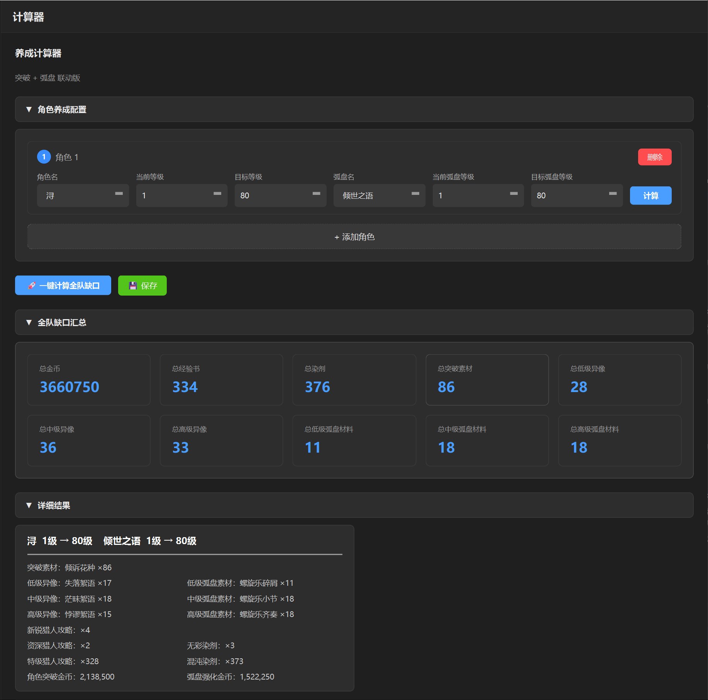
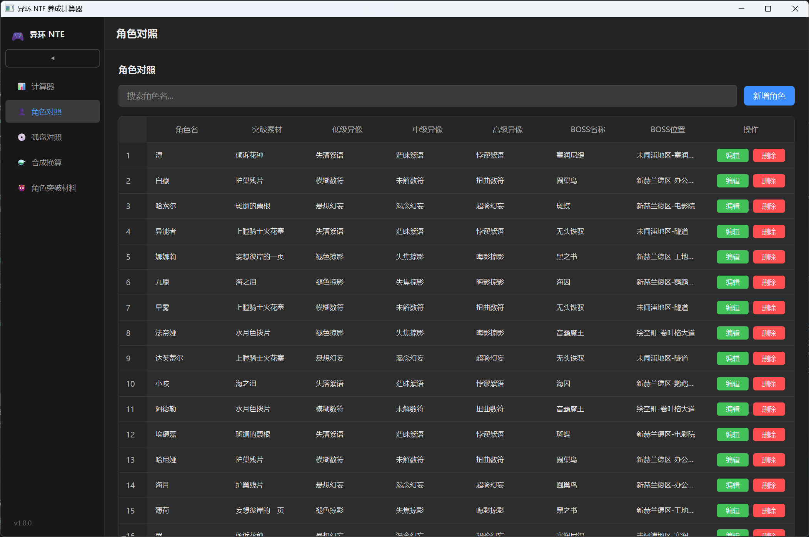
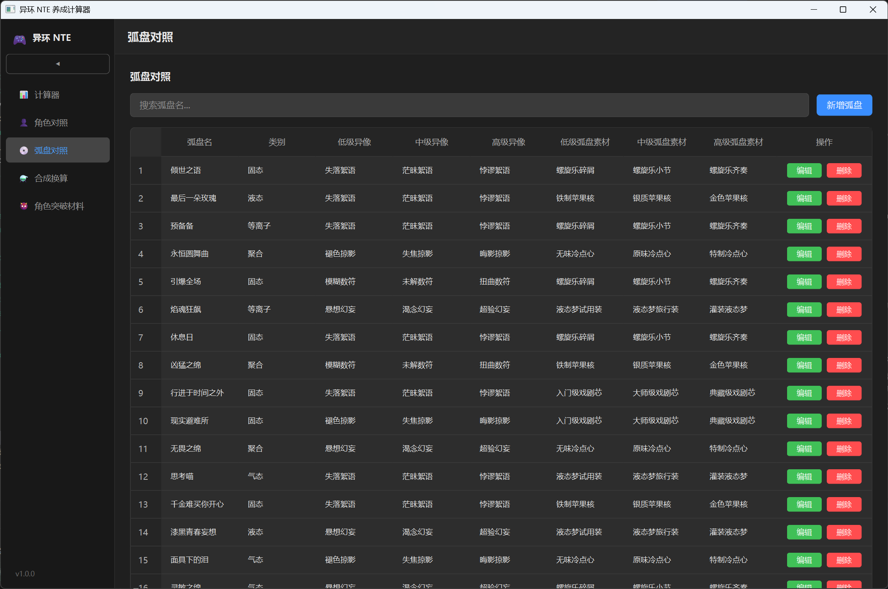
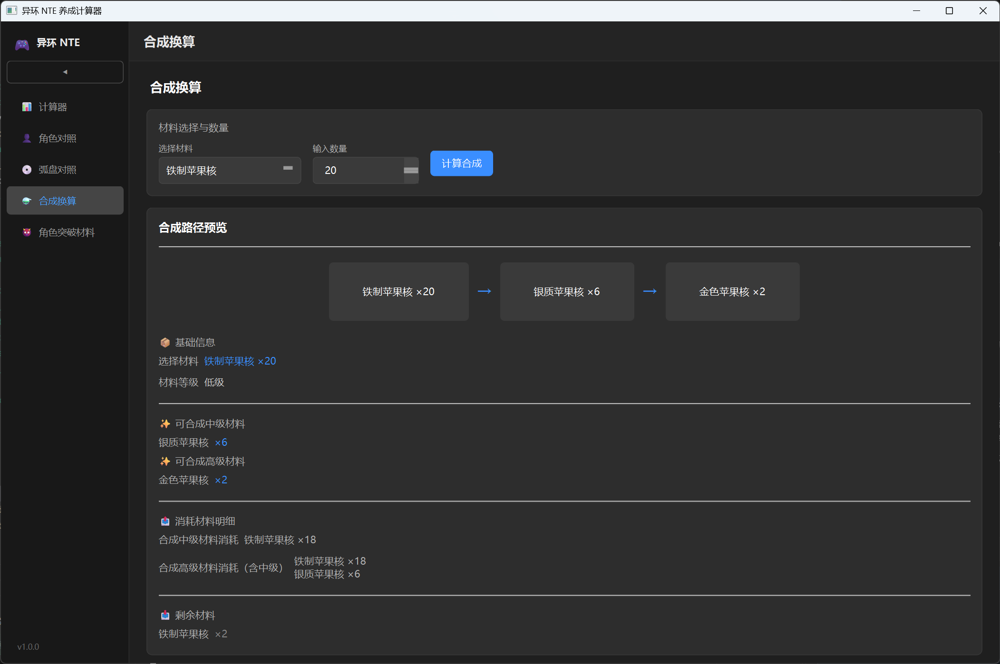

# 异环 NTE 全角色养成计算器 (GUI版)

基于 PyQt6 的图形化角色养成材料缺口计算器，用于异环(NTE)游戏中角色突破和弧盘强化材料的自动计算与规划。

## 功能特性

- **角色养成计算** — 选择角色/弧盘，输入当前等级→目标等级，自动计算所需全部材料
- **一键全队缺口** — 多角色批量录入，一键汇总全队材料缺口
- **详细结果卡片** — 每角色独立卡片展示突破素材、异像、弧盘素材、攻略书、染剂、金币等明细
- **材料合成换算** — 低级/中级/高级材料间的合成路径计算（含流程图展示）
- **角色对照管理** — 维护角色名称与突破材料的映射关系，支持增删改查
- **弧盘对照管理** — 维护弧盘名称与强化材料的映射关系，支持增删改查
- **角色突破材料管理** — 维护周本BOSS与掉落材料的对应关系
- **数据持久化** — 所有修改自动保存到 JSON 文件，重启后数据不丢失
- **动态经验计算** — 攻略书和染剂数量基于经验值最优解动态分配
- **深色主题** — 护眼的深色界面设计

## 实际画面





## 项目结构

```
nte_calculator_project/
├── main.py                          # 主入口（启动 GUI）
├── config.py                        # 全局配置
├── requirements.txt                 # 依赖清单
├── mint_icon_512x512.png            # 应用图标
│
├── gui/                             # GUI 界面层
│   ├── main_window.py               # 主窗口 + 左侧导航栏
│   ├── components/
│   │   └── accordion_panel.py       # 折叠面板组件
│   ├── pages/
│   │   ├── calculator_page.py       # 养成计算器（核心页面）
│   │   ├── character_ref_page.py    # 角色对照管理
│   │   ├── arc_ref_page.py          # 弧盘对照管理
│   │   ├── weekly_boss_page.py      # 角色突破材料管理
│   │   └── craft_page.py            # 材料合成换算
│   └── styles/
│       └── dark_theme.qss           # 深色主题样式
│
├── core/                            # 核心计算引擎
│   ├── calculator.py                # 缺口计算引擎
│   └── database.py                  # 数据库工具
│
├── data/                            # 数据层
│   ├── character_data.py            # 角色突破材料数据
│   ├── arc_data.py                  # 弧盘强化材料数据
│   ├── material_data.py             # 材料合成/周本/经验书数据
│   ├── boss_data.py                 # BOSS 材料数据
│   └── user_data/                   # 用户持久化数据（JSON）
│       ├── character_data.json      # 角色对照数据
│       ├── arc_data.json            # 弧盘对照数据
│       ├── boss_data.json           # BOSS 材料数据
│       └── character_config.json    # 养成配置存档
│
└── utils/                           # 工具模块
    ├── formatter_builder.py         # Excel 公式构建
    └── styles.py                    # Excel 样式工具
```

## 安装依赖

```bash
pip install -r requirements.txt
```

依赖清单：`openpyxl`、`PyQt6`

## 使用方法

```bash
python main.py
```

### 页面导航

| 导航项 | 功能说明 |
|--------|----------|
| 养成计算器 | 核心计算页面，选择角色/弧盘、设置等级、计算缺口 |
| 角色对照 | 管理角色名→突破材料的映射关系 |
| 弧盘对照 | 管理弧盘名→强化材料的映射关系 |
| 角色突破材料 | 管理周本BOSS与掉落材料数据 |
| 合成换算 | 低级/中级/高级材料的合成路径计算 |

### 数据持久化

- 角色对照、弧盘对照、BOSS 数据在修改后自动保存到 `data/user_data/` 目录下的 JSON 文件
- 养成配置可通过「保存」按钮手动存档，重启后自动加载

## 打包构建

使用 PyInstaller 打包为独立可执行文件：

```bash
pip install pyinstaller pillow
pyinstaller --onedir --windowed --icon="mint_icon.ico" --name="异环NTE养成计算器" main.py
```

## 数据维护

当游戏版本更新时，修改 `data/` 目录下对应 Python 文件中的数据字典即可：
- `character_data.py` — 角色升级经验表、角色→材料映射
- `arc_data.py` — 弧盘升级经验表、弧盘→材料映射
- `material_data.py` — 材料合成配方、经验书数据、染剂数据

## 作者
兔唧唧的萝卜酱
版本V1.1